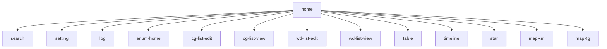
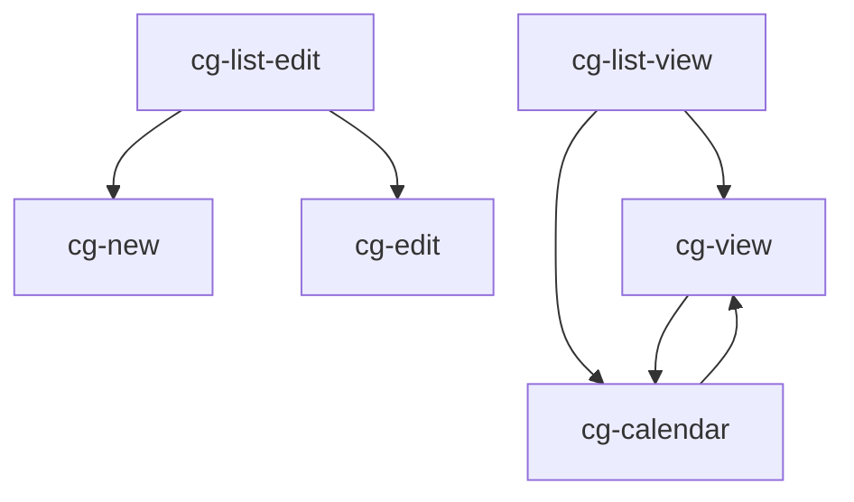
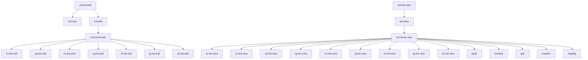
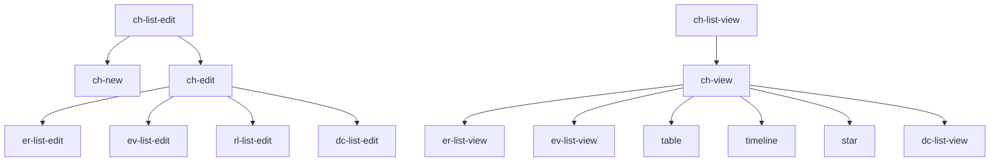
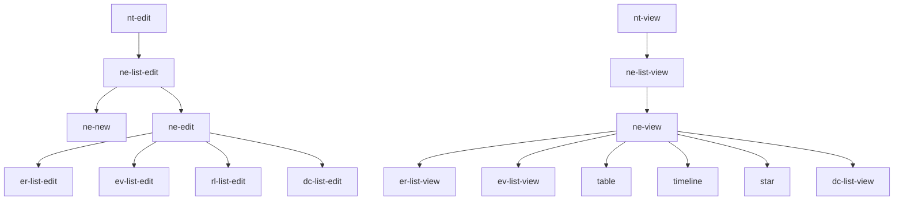
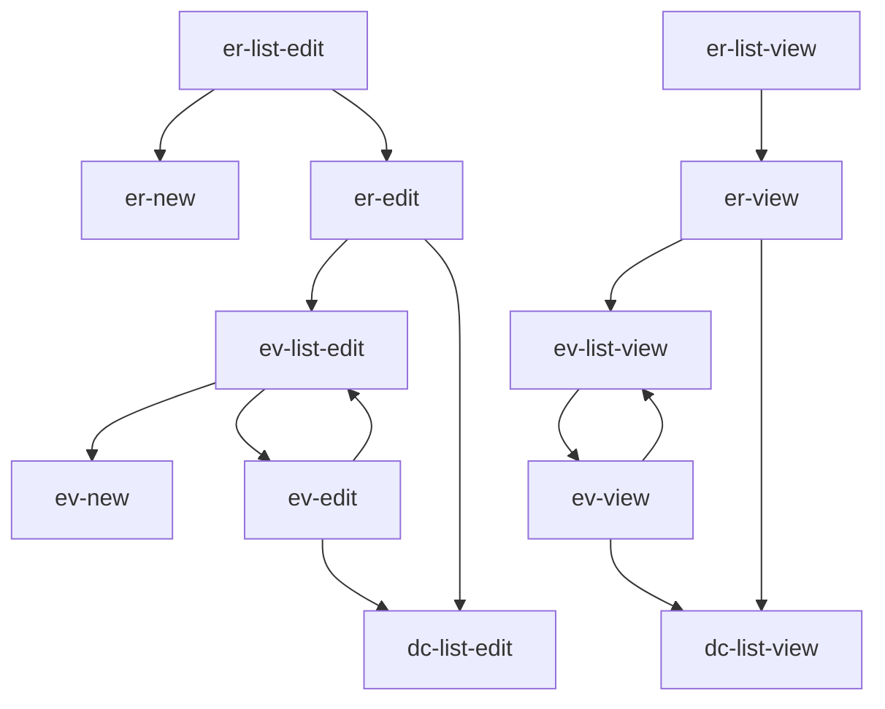
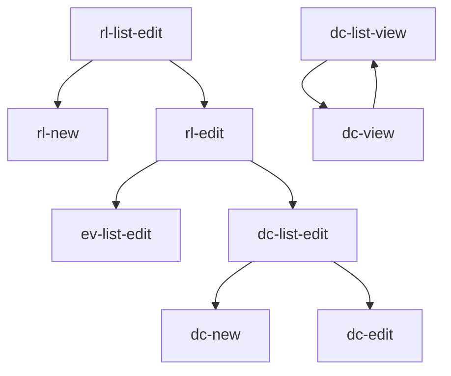
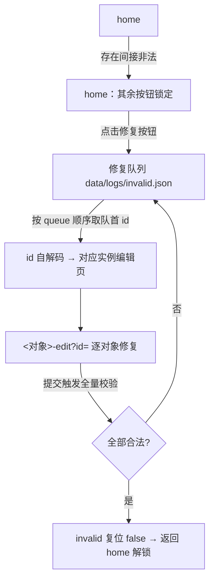

# Navigation 路由

## 1. 代号规范

页面代号是页面在路由中的唯一标识，遵循以下约定：

| 页面类别 | 代号形式 | 说明 |
|---|---|---|
| 对象管理页 | `<对象代号>-<模式>` | 模式为 `list-edit` / `list-view` / `new` / `edit` / `view` |
| 世界主页 | `wd-home-edit` / `wd-home-view` | `World` 的特例页 |
| 演示页 | `table` / `timeline` / `star` / `mapRm` / `mapRg` / `cg-calendar` | 无对象代号前缀 |
| 系统页 | `home` / `search` / `setting` / `log` / `enum-home` | — |
| 枚举页 | `<枚举代号>-<模式>` | 模式为 `list-edit` / `new` / `edit` |

**对象代号**（与数据文件夹、对象类型代号对应）：`Cg→cg`、`Wd→wd`、`Ch→ch`、`Og→og`、`Rm→rm`、`Rg→rg`、`Nt→nt`、`Ne→ne`、`Tg→tg`、`Er→er`、`Ev→ev`、`Rl→rl`、`Dc→dc`。

**枚举代号**（仅可注册枚举设页面；`Gender`、`SpanType` 固定不可扩展，无注册页）：`CharacterType→ct`、`OrganizationType→ot`、`RegimeType→rmt`、`EventType→et`、`RelationshipType→rlt`。

## 2. 入参规范

页面通过入参确定作用对象，以 query 形式携带（如 `?id=Cg0_Wd0`）：

| 参数 | 含义 | 用于 |
|---|---|---|
| `id` | 对象实例 id | 实例页 `<obj>-view` / `<obj>-edit`；万年历 `cg-calendar`；枚举编辑页（枚举值自然数） |
| `scope` | 所属对象 id | 列表页 `<obj>-list-view` / `<obj>-list-edit`，列出该对象的下级对象；无上级对象的列表（`Cg` / `Wd` 列表）不携带 |
| `entity` | 初始选中实体 id | 演示页 `table` / `timeline` / `star`，作选择框初始值；可为空，为空时用户页内选择 |
| `world` | 初始选中世界 id | 地图页 `mapRm` / `mapRg`；可为空 |
| `q` | 初始搜索词 | 搜索页 `search`；可为空 |

说明：

- **页内选择不入栈**：演示页切换选择框实体、星图换中心、列表页内切换选中项等，均不入栈。
- **id 自解码**：`id` 本质是物化路径（见 `OBJECTS\ELEMENTS\Id.md`），可解码出对象类型与祖先链；凡渲染 `id` 处即链接（引用即链接）。
- **入参推导**：`scope` 与 `entity` / `world` 都可由 `id` 自解码得到；实例页 → 其上级对象构成列表页的 `scope`。

## 3. 页面清单

### 3.1 系统页

| 页面代号 | 页面名 | 入参 | 功能 | 可以跳转去的页面 |
|---|---|---|---|---|
| `home` | 首页 | — | 导航与搜索入口；存在间接非法时其余按钮锁定（见修复模式） | 历法列表-编辑, 枚举主页, 世界列表-编辑, 搜索, 历法列表-查看, 世界列表-查看, 大事年表, 时间轴, 关系星图, 政权地图, 地区地图, 设置, 日志 |
| `search` | 搜索 | `q?` | 输入的字符与所有元信息和最下级对象的所有文本对比匹配，结果高亮 | 命中对象 → 对应 `<obj>-view?id=` |
| `setting` | 设置 | — | 编辑 `Config` 单例（外观 / 语言 / 校验周期 / 调色盘） | — |
| `log` | 日志 | — | 查看日志与非法清单（`data\logs\`）；存在非法时提供修复模式入口 | 修复模式 |
| `enum-home` | 枚举主页 | — | 列出全部可注册枚举类型，提供注册 / 编辑入口 | 各枚举对象列表-编辑 |

### 3.3 世界（World）

| 页面代号 | 页面名 | 入参 | 功能 | 可以跳转去的页面 |
|---|---|---|---|---|
| `wd-list-edit` | 世界列表-编辑 | — | 可删除已创建世界 | 世界实例-新建, 世界实例-编辑 |
| `wd-new` | 世界实例-新建 | — | 可新建世界及描述文档 | — |
| `wd-edit` | 世界实例-编辑 | `id` | 可编辑已创建世界元信息及描述文档 | 该世界的世界主页-编辑 |
| `wd-list-view` | 世界列表-查看 | — | 可查看已创建世界名 | 世界实例-查看 |
| `wd-view` | 世界实例-查看 | `id` | 可查看已创建世界元信息及描述文档 | 该世界的世界主页-查看 |

### 3.4 世界主页

| 页面代号 | 页面名 | 入参 | 功能 | 可以跳转去的页面 |
|---|---|---|---|---|
| `wd-home-edit` | 世界主页-编辑 | `id` | 聚合该世界下各类对象的列表-编辑入口 | 该世界的角色列表-编辑, 该世界的组织列表-编辑, 该世界的政权列表-编辑, 该世界的地区列表-编辑, 该世界的模板列表-编辑, 该世界的标签列表-编辑, 该世界的文档列表-编辑 |
| `wd-home-view` | 世界主页-查看 | `id` | 聚合该世界下各类对象的列表-查看入口与演示页入口 | 该世界的时期列表-查看, 该世界的事件列表-查看, 大事年表(选择框内实体为该世界), 时间轴(选择框内实体为该世界), 该世界的角色列表-查看, 该世界的组织列表-查看, 该世界的政权列表-查看, 政权地图(选择框内世界为该世界), 该世界的地区列表-查看, 地区地图(选择框内世界为该世界), 该世界的模板列表-查看, 该世界的标签列表-查看, 关系星图(选择框内实体为该世界), 该世界的文档列表-查看 |

### 3.5 角色（Character）

| 页面代号 | 页面名 | 入参 | 功能 | 可以跳转去的页面 |
|---|---|---|---|---|
| `ch-list-edit` | 角色列表-编辑 | `scope` | 可删除该世界已创建角色 | 角色实例-新建, 角色实例-编辑 |
| `ch-new` | 角色实例-新建 | `scope` | 可新建角色及描述文档 | — |
| `ch-edit` | 角色实例-编辑 | `id` | 可编辑已创建角色元信息及描述文档 | 该角色的时期列表-编辑, 该角色的事件列表-编辑, 该角色的关系列表-编辑, 该角色的文档列表-编辑 |
| `ch-list-view` | 角色列表-查看 | `scope` | 可查看该世界已创建角色名 | 角色实例-查看 |
| `ch-view` | 角色实例-查看 | `id` | 可查看已创建角色元信息及描述文档 | 该角色的时期列表-查看, 该角色的事件列表-查看, 大事年表(选择框内实体为该角色), 时间轴(选择框内实体为该角色), 关系星图(选择框内实体为该角色), 该角色的文档列表-查看 |

### 3.6 组织（Organization）

| 页面代号 | 页面名 | 入参 | 功能 | 可以跳转去的页面 |
|---|---|---|---|---|
| `og-list-edit` | 组织列表-编辑 | `scope` | 可删除该世界已创建组织 | 组织实例-新建, 组织实例-编辑 |
| `og-new` | 组织实例-新建 | `scope` | 可新建组织及描述文档 | — |
| `og-edit` | 组织实例-编辑 | `id` | 可编辑已创建组织元信息及描述文档 | 该组织的时期列表-编辑, 该组织的事件列表-编辑, 该组织的关系列表-编辑, 该组织的文档列表-编辑 |
| `og-list-view` | 组织列表-查看 | `scope` | 可查看该世界已创建组织名 | 组织实例-查看 |
| `og-view` | 组织实例-查看 | `id` | 可查看已创建组织元信息及描述文档 | 该组织的时期列表-查看, 该组织的事件列表-查看, 大事年表(选择框内实体为该组织), 时间轴(选择框内实体为该组织), 关系星图(选择框内实体为该组织), 该组织的文档列表-查看 |

### 3.7 政权（Regime）

| 页面代号 | 页面名 | 入参 | 功能 | 可以跳转去的页面 |
|---|---|---|---|---|
| `rm-list-edit` | 政权列表-编辑 | `scope` | 可删除该世界已创建政权 | 政权实例-新建, 政权实例-编辑 |
| `rm-new` | 政权实例-新建 | `scope` | 可新建政权及描述文档 | — |
| `rm-edit` | 政权实例-编辑 | `id` | 可编辑已创建政权元信息及描述文档 | 该政权的时期列表-编辑, 该政权的事件列表-编辑, 该政权的关系列表-编辑, 该政权的文档列表-编辑 |
| `rm-list-view` | 政权列表-查看 | `scope` | 可查看该世界已创建政权名 | 政权实例-查看 |
| `rm-view` | 政权实例-查看 | `id` | 可查看已创建政权元信息及描述文档 | 该政权的时期列表-查看, 该政权的事件列表-查看, 大事年表(选择框内实体为该政权), 时间轴(选择框内实体为该政权), 政权地图(选择框内世界为该政权所属世界), 关系星图(选择框内实体为该政权), 该政权的文档列表-查看 |

### 3.8 地区（Region）

| 页面代号 | 页面名 | 入参 | 功能 | 可以跳转去的页面 |
|---|---|---|---|---|
| `rg-list-edit` | 地区列表-编辑 | `scope` | 可删除该世界已创建地区 | 地区实例-新建, 地区实例-编辑 |
| `rg-new` | 地区实例-新建 | `scope` | 可新建地区及描述文档 | — |
| `rg-edit` | 地区实例-编辑 | `id` | 可编辑已创建地区元信息及描述文档 | 该地区的时期列表-编辑, 该地区的事件列表-编辑, 该地区的关系列表-编辑, 该地区的文档列表-编辑 |
| `rg-list-view` | 地区列表-查看 | `scope` | 可查看该世界已创建地区名 | 地区实例-查看 |
| `rg-view` | 地区实例-查看 | `id` | 可查看已创建地区元信息及描述文档 | 该地区的时期列表-查看, 该地区的事件列表-查看, 大事年表(选择框内实体为该地区), 时间轴(选择框内实体为该地区), 地区地图(选择框内世界为该地区所属世界), 关系星图(选择框内实体为该地区), 该地区的文档列表-查看 |

### 3.9 模板（NewEntityTemplate）

| 页面代号 | 页面名 | 入参 | 功能 | 可以跳转去的页面 |
|---|---|---|---|---|
| `nt-list-edit` | 模板列表-编辑 | `scope` | 可删除该世界已创建模板 | 模板实例-新建, 模板实例-编辑 |
| `nt-new` | 模板实例-新建 | `scope` | 可新建模板及描述文档 | — |
| `nt-edit` | 模板实例-编辑 | `id` | 可编辑已创建模板元信息及描述文档 | 该模板的实体列表-编辑, 该模板的文档列表-编辑 |
| `nt-list-view` | 模板列表-查看 | `scope` | 可查看该世界已创建模板名 | 模板实例-查看 |
| `nt-view` | 模板实例-查看 | `id` | 可查看已创建模板元信息及描述文档 | 该模板的实体列表-查看, 该模板的文档列表-查看 |

### 3.10 自定义实体（NewEntity）

| 页面代号 | 页面名 | 入参 | 功能 | 可以跳转去的页面 |
|---|---|---|---|---|
| `ne-list-edit` | 自定义实体列表-编辑 | `scope` | 可删除该模板已创建自定义实体 | 自定义实体实例-新建, 自定义实体实例-编辑 |
| `ne-new` | 自定义实体实例-新建 | `scope` | 可新建自定义实体及描述文档 | — |
| `ne-edit` | 自定义实体实例-编辑 | `id` | 可编辑已创建自定义实体元信息及描述文档 | 该自定义实体的时期列表-编辑, 该自定义实体的事件列表-编辑, 该自定义实体的关系列表-编辑, 该自定义实体的文档列表-编辑 |
| `ne-list-view` | 自定义实体列表-查看 | `scope` | 可查看该模板已创建自定义实体名 | 自定义实体实例-查看 |
| `ne-view` | 自定义实体实例-查看 | `id` | 可查看已创建自定义实体元信息及描述文档 | 该自定义实体的时期列表-查看, 该自定义实体的事件列表-查看, 大事年表(选择框内实体为该自定义实体), 时间轴(选择框内实体为该自定义实体), 关系星图(选择框内实体为该自定义实体), 该自定义实体的文档列表-查看 |

### 3.11 标签（Tag）

| 页面代号 | 页面名 | 入参 | 功能 | 可以跳转去的页面 |
|---|---|---|---|---|
| `tg-list-edit` | 标签列表-编辑 | `scope` | 可删除该世界已创建标签 | 标签实例-新建, 标签实例-编辑 |
| `tg-new` | 标签实例-新建 | `scope` | 可新建标签及描述文档 | — |
| `tg-edit` | 标签实例-编辑 | `id` | 可编辑已创建标签元信息及描述文档 | 该标签的文档列表-编辑 |
| `tg-list-view` | 标签列表-查看 | `scope` | 可查看该世界已创建标签名 | 标签实例-查看 |
| `tg-view` | 标签实例-查看 | `id` | 可查看已创建标签元信息及描述文档 | 大事年表(选择框内实体为该标签), 时间轴(选择框内实体为该标签), 该标签结算聚合的文档列表-查看 |

### 3.12 时期（Era）

| 页面代号 | 页面名 | 入参 | 功能 | 可以跳转去的页面 |
|---|---|---|---|---|
| `er-list-edit` | 时期列表-编辑 | `scope` | 可删除已创建时期 | 时期实例-新建, 时期实例-编辑 |
| `er-new` | 时期实例-新建 | `scope` | 可新建时期及描述文档 | — |
| `er-edit` | 时期实例-编辑 | `id` | 可编辑已创建时期元信息及描述文档 | 该时期的（子）事件列表-编辑, 该时期的文档列表-编辑 |
| `er-list-view` | 时期列表-查看 | `scope` | 可查看已创建时期名 | 时期实例-查看 |
| `er-view` | 时期实例-查看 | `id` | 可查看已创建时期元信息及描述文档 | 该时期的（子）事件列表-查看, 该时期的文档列表-查看 |

### 3.13 事件（Event）

| 页面代号 | 页面名 | 入参 | 功能 | 可以跳转去的页面 |
|---|---|---|---|---|
| `ev-list-edit` | 事件列表-编辑 | `scope` | 可删除已创建事件 | 事件实例-新建, 事件实例-编辑 |
| `ev-new` | 事件实例-新建 | `scope` | 可新建事件及描述文档 | — |
| `ev-edit` | 事件实例-编辑 | `id` | 可编辑已创建事件元信息及描述文档 | 该事件的（子）事件列表-编辑, 该事件的文档列表-编辑 |
| `ev-list-view` | 事件列表-查看 | `scope` | 可查看已创建事件名 | 事件实例-查看 |
| `ev-view` | 事件实例-查看 | `id` | 可查看已创建事件元信息及描述文档 | 该事件的（子）事件列表-查看, 该事件的文档列表-查看 |

### 3.14 关系（Relationship）

> 关系无查看页；关系的查看通过关系星图 `star`（以实体为中心），即"查看"入口一律指向星图。

| 页面代号 | 页面名 | 入参 | 功能 | 可以跳转去的页面 |
|---|---|---|---|---|
| `rl-list-edit` | 关系列表-编辑 | `scope` | 可删除该实体已创建关系 | 关系实例-新建, 关系实例-编辑 |
| `rl-new` | 关系实例-新建 | `scope` | 可新建关系及描述文档, 可新建另一方向关系及描述文档 | — |
| `rl-edit` | 关系实例-编辑 | `id` | 可编辑已创建关系元信息及描述文档, 可编辑另一方向关系及描述文档 | 该关系的事件列表-编辑, 该关系的文档列表-编辑 |

### 3.15 文档（Document）

| 页面代号 | 页面名 | 入参 | 功能 | 可以跳转去的页面 |
|---|---|---|---|---|
| `dc-list-edit` | 文档列表-编辑 | `scope` | 可删除该对象已创建文档 | 文档实例-新建, 文档实例-编辑 |
| `dc-new` | 文档实例-新建 | `scope` | 可新建文档 | — |
| `dc-edit` | 文档实例-编辑 | `id` | 可编辑已创建文档 | — |
| `dc-list-view` | 文档列表-查看 | `scope` | 可查看该对象已创建文档名 | 文档实例-查看 |
| `dc-view` | 文档实例-查看 | `id` | 可查看已创建文档 | （子）文档列表-查看 |

### 3.16 演示页

| 页面代号 | 页面名 | 入参 | 功能 | 可以跳转去的页面 |
|---|---|---|---|---|
| `table` | 大事年表 | `entity?` | 以大事年表形式查看选中实体的事件（按开始时间排序，时期在侧栏划出高度） | — |
| `timeline` | 时间轴 | `entity?` | 以时间轴形式查看选中实体的事件（TimelineJS，最高层时期 + 各实体事件分组） | — |
| `star` | 关系星图 | `entity?` | 以所选实体为中心查看已创建关系名, 附元信息、描述文档和文档列表-查看；点击另一个实体换到中心 | — |
| `mapRm` | 政权地图 | `world?` | 可查看选中世界的政权地图（提供观察者时间选择，切换即时重算着色） | 点击政权 → `rm-view?id=` |
| `mapRg` | 地区地图 | `world?` | 可查看选中世界的地区地图（提供观察者时间选择，切换即时重算着色） | 点击地区 → `rg-view?id=` |

### 3.17 元素编辑组件

`ELEMENT` 编辑界面一律做成**组件**，内嵌于所属对象的实例编辑页，无独立代号、不单独入栈、不构成跳转目标：

| 组件 | 内嵌位置 | 编辑内容 |
|---|---|---|
| Piecewise 组件 | 对象编辑页（`wd-edit` / `ch-edit` / `og-edit` / `rm-edit` / `rg-edit` / `ne-edit` 等） | 分段值：增删 `Pw` 段、选择 `Span`、编辑 `value` |
| Property 组件 | 对象编辑页 | 属性 `key`-`value` 列表（value 可为 number / string / Id） |
| Territory 编辑组件（Map 编辑器） | `rm-edit` / `rg-edit` | 领土可视化涂抹，按瓦片法记录为区块坐标 |
| Span 组件 | 各实例编辑页 | 时间段（TimePoint + SpanType） |
| TimePoint 组件 | 各实例编辑页 | 时间点（各级历法单位） |
| Unit 组件 / LeapRule 组件 | `cg-new` / `cg-edit` | 历法单位与闰则 |
| TemplateProperty 组件 | `nt-new` / `nt-edit` | 模板属性键与值类型（number / string / id / span / territory） |

### 3.18 枚举页

可注册枚举各设 `list-edit` / `new` / `edit` 三种页面，入参 `id` 为枚举值（自然数）：

| 页面代号 | 页面名 | 入参 | 功能 | 可以跳转去的页面 |
|---|---|---|---|---|
| `ct-list-edit` | 角色类型列表-编辑 | — | 可删除已注册角色类型 | `ct-new`, `ct-edit?id=` |
| `ct-new` | 角色类型-注册 | — | 注册新角色类型（所有语言必需） | — |
| `ct-edit` | 角色类型-编辑 | `id` | 编辑角色类型多语言 | — |
| `ot-list-edit` / `ot-new` / `ot-edit` | 组织类型 | — / — / `id` | 组织类型注册 / 编辑（所有语言必需） | 同模式同上 |
| `rmt-list-edit` / `rmt-new` / `rmt-edit` | 政权类型 | — / — / `id` | 政权类型注册 / 编辑（所有语言必需） | 同上 |
| `et-list-edit` / `et-new` / `et-edit` | 事件类型 | — / — / `id` | 事件类型注册 / 编辑；注册时需声明 `allow`（可赋给哪些实体） | 同上 |
| `rlt-list-edit` / `rlt-new` / `rlt-edit` | 关系类型 | — / — / `id` | 关系类型注册 / 编辑；注册时需声明 `allow`（可赋给哪些关系对） | 同上 |

## 4. 跳转图

### 4.1 系统页

### 4.2 历法组

### 4.3 世界组

### 4.4 实体组（以角色为例；`og` / `rm` / `rg` / `nt` / `tg` 同构）

实体间差异：

| 实体 | 与角色模式的差异 |
|---|---|
| `og` | 无差异 |
| `rm` | 另含 `rm-view --> mapRm`（选择框内世界为该政权所属世界） |
| `rg` | 另含 `rg-view --> mapRg`（选择框内世界为该地区所属世界） |
| `nt` | `nt-edit` 的下级列表为 `ne-list-edit` / `dc-list-edit`；`nt-view` 为 `ne-list-view` / `dc-list-view`（见 4.5） |
| `tg` | 无**直接下级**时期事件关系列表 |

### 4.5 自定义实体组（`ne`，经模板页进入）

### 4.6 时期 / 事件组

### 4.7 关系组 / 文档组

## 5. 修复模式

存在间接非法时（见 `Verify.md`）：首页其他按钮锁定，仅显示"请先修改非法数据"按钮。

- 修复队列按（深度升序，同层 id 数字感知自然序）排列，逐对象引导修改。
- 每次成功提交后触发全量校验；全部合法后 `invalid` 复位为 `false`，返回首页并复位解锁。
- 修复期间仅允许进入与修复对象相关的编辑页，其余页面保持锁定。

## 6. 规则

- **页内选择不入栈**
- **跳转动作入栈**
- **id 自解码**

### 元素编辑均为组件

`ELEMENT` 及 Unit / LeapRule / TemplateProperty 等的编辑界面一律做成**组件**，内嵌于所属对象的实例编辑页，不构成独立路由、不作为跳转目标（见 §3.17）。

### 引用即链接

凡是 `id`，在查看时，若存在该对象，渲染为链接，点击跳转到对应 `<obj>-view?id=`。

### 新建提交后的跳转

新建 / 注册提交成功后，返回到对应列表页 `<obj>-list-edit`（保持该新建对象所属的 `scope`，便于连续新建多个对象；枚举返回对应 `-list-edit`）。此规则为建议新增，原文未定义。

### 修复模式

存在间接非法时，首页其他按钮锁定，显示"请先修改非法数据"按钮，点击后逐对象编辑，全部合法后复位解锁。

## 7. 返回

- 优先弹栈
- 栈空时按 id 推导返回（见下）

### 栈空推导规则

`id` 是物化路径，可自解码出祖先链；栈空时按"逐级上溯"推导返回目标：

| 当前页 | 推导返回目标 |
|---|---|
| 实例查看 / 编辑页（带 `id`） | 上级对象 id 对应的**列表页**（`scope` = 上级 id，同模式：view→`-list-view`，edit→`-list-edit`）；对象为最上级（`Cg` / `Wd`）→ 其无 scope 的列表页 |
| 列表页（带 `scope`） | `scope` 对象的默认查看页（`World` → `wd-home-view`，其余 → 对应 `<obj>-view`） |
| 列表页（无 scope，`Cg` / `Wd` 列表） | `home` |
| 演示页（带 `entity` / `world` / `id`） | 选中实体的默认查看页；无参数 → `home` |
| 系统页 / 枚举页 | `home` |

**默认查看页**：`World` → `wd-home-view`；其余对象 → 对应 `<obj>-view`；`Chronology` 无父对象，返回 `cg-list-view`。

**推导示例**：

- `ch-view?id=Cg0_Wd0_Ch0` → `ch-list-view?scope=Cg0_Wd0`
- `ch-list-view?scope=Cg0_Wd0` → `wd-home-view?id=Cg0_Wd0`
- `ev-view?id=Cg0_Wd0_Ch0_Ev0` → `ev-list-view?scope=Cg0_Wd0_Ch0`
- `wd-view?id=Cg0_Wd0` → `wd-list-view`
- `table?entity=Cg0_Wd0_Ch0` → `ch-view?id=Cg0_Wd0_Ch0`
- `mapRm?world=Cg0_Wd0` → `wd-home-view?id=Cg0_Wd0`
- `cg-calendar?id=Cg0` → `cg-view?id=Cg0`