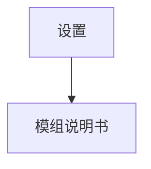

# Config

## Config 配置

### 概要

`Config` 记录软件的配置
单例，数据的修改立即生效
简称 cfg

### 数据

#### 位置

[setting.toml](./../../../setting.toml)

#### 格式

| 表 |
|---|
| `[appearance]` |
| `[language]` |
| `[verify]` |
| `[palette]` |
| `[mod]` |

#### 校验

- 扫描：
    - 当要求扫描时，扫描
        - `[palette]`
        - `[mod]`

- 通知：
    - 当重置时，需用户确认

### 服务

[ConfigService](./../../../engine/main/services/ConfigService.ts)

### 页面组件

import Component.md#macro-宏

#### sett

页面标题：设置

以下是部分主要组件：

- bt-bk
- sett-apr
- sett-lgg
- sett-vrf
- sett-plt
- sett-mod
- bt-rs — 重置为默认配置
- bt-sv

## [appearance] 外观

### 概要

`[appearance]` 记录软件的外观配置
数据的修改立即生效
简称 apr

### 数据

#### 格式

`m` 是深色模式开关
默认为 0

| 值 | 含义 |
|---|---|
| 0 | 跟随系统 |
| 1 | 浅色模式 |
| 2 | 深色模式 |

### 页面组件

import Component.md#macro-宏

#### sett-apr

这是 `[appearance]` 设置组件

以下是部分主要子组件：

- tx 说明文字
- bt-sft 跟随系统、浅色模式、深色模式

## [language] 语言

### 概要

`[language]` 记录软件的语言配置
数据的修改立即生效
简称 lgg

### 数据

#### 格式

`l` 是软件所用语言
默认为 'zh_CN'

| 值 | 含义 |
|---|---|
| 'de_DE' | 德语 |
| 'en_US' | 英语（美国） |
| 'es_ES' | 西班牙语 |
| 'fr_FR' | 法语 |
| 'ja_JP' | 日语 |
| 'ko_KR' | 韩语 |
| 'ru_RU' | 俄语 |
| 'zh_CN' | 简体中文 |
| 'zh_TW' | 繁体中文 |

### 页面组件

import Component.md#macro-宏

#### sett-lgg

这是 `[language]` 设置组件

以下是部分主要子组件：

- tx 说明文字
- bt-sft 以上语言

## [verify] 校验

### 概要

`[verify]` 记录软件的校验配置
数据的修改立即生效
简称 vrf

### 数据

#### 格式

`T` 是全局校验自动触发的周期，单位是秒
默认为 60
值的范围是：INTEGER 且 >= 30 且 <= 1200

#### 校验

- 拦截：
    - 值不在范围内

- 扫描：
    - 当要求扫描时，扫描
        - 拦截内容

- 通知：
    - 当 T > 120 时，提醒用户校验间隔较长

### 页面组件

import Component.md#macro-宏

#### sett-vrf

这是 `[verify]` 设置组件

以下是部分主要子组件：

- tx 说明文字
- inp-nm — 编辑 `T`

## [palette] 调色盘

### 概要

`[palette]` 记录用色配置
数据的修改立即生效
简称 plt

### 数据

#### 格式

| 键 | 含义 | 默认值 | 值的范围 |
|---|---|---|---|
| `RmNum` | 用多少种颜色去轮流涂政权地图 | 8 | INTEGER 且 >= 4 且 <= 16 |
| `RmArray` | 用什么颜色 | ['#ffb0b0','#ffd1b0','#ffeeb0','#ffffb0','#baffb0','#b0ffed','#b0ddff','#b0c4ff'] | 一组十六进制颜色 |

#### 校验

- 拦截：
    - `RmNum` 的值不在范围内

- 扫描：
    - 当要求扫描时，扫描
        - 拦截内容

### 页面组件

import Component.md#macro-宏

#### sett-plt

这是 `[palette]` 设置组件

以下是部分主要子组件：

- tx 说明文字
- 一排颜色，每个后面有 bt-dl-sg
- 按钮 `新增颜色` — 在这排颜色后新增一个颜色
- 颜色选择器 — 编辑一个颜色

## [mod] 模组

### 概要

`[mod]` 记录用色配置
数据的修改立即生效
简称 plt

### 数据

#### 格式

`installed` 是已安装模组名数组，没有默认，根据当前模组列表显示
`enabled` 是启用模组名数组，没有默认，不会被重置

#### 校验

- 拦截：
    - 模组名重复

- 扫描：
    - 当要求扫描时，扫描
        - 拦截内容
        - 启用状态改变的模组的扫描清单
    - 当导入模组时，扫描
        - 该模组的扫描清单

### 页面组件

import Component.md#macro-宏

#### sett-mod

这是 `[mod]` 设置组件

以下是部分主要子组件：

- 模组列表 — 列出已安装模组名，点击跳转 sett-mod-dc-view
- 每个模组名后面有 bt-sft 启用、禁用
- 按钮 `安装模组` — 打开资源管理器窗口，导入模组

#### sett-mod-dc-view

页面标题：模组说明书

部分主要组件与 dc-view 相同

### 跳转图

