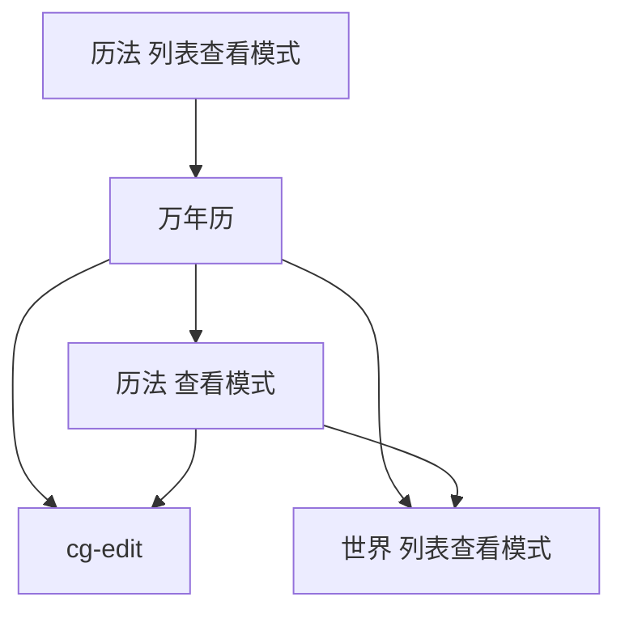

# Calendar

## 概要

这是一个查看器模组
新增一种 Chronology 查看页面

## 内容

[*.*](./../../../../mods/Calendar/*.*)

## 校验

- 扫描：
    - 当要求扫描时，扫描
        - 所有 `Chronology`

## 页面组件

import Component.md#macro-宏

### cg-list-view

页面标题：历法  列表查看模式

以下是模组修改的组件：

- 历法列表 — 列出已创建历法名，点击跳转 cg-calendar

### cg-view

页面标题：历法  查看模式

以下是模组新增的组件：

- 按钮 `查看万年历` — 跳转 cg-calendar

### cg-calendar

页面标题：万年历

以下是部分主要组件：

- bt-bk
- tx `name`
- 万年历，显示的最小单位是有固定前沿的最大单位
- 按钮 `查看详情` — 跳转 cg-view
- bt-to-ed — 跳转 cg-edit
- 按钮 `查看世界` — 跳转 wd-list-view，该页面的 slc-cg，已经选中该历法

## 跳转图

