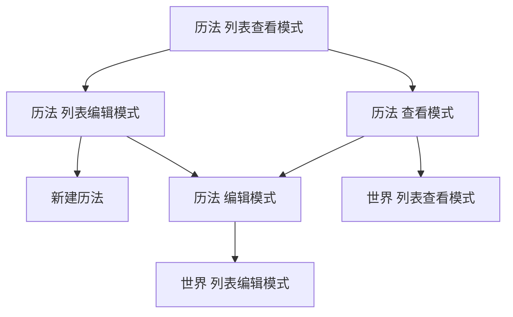

# Chronology

## Chronology 历法

### 概要

`Chronology` 描述一个历法
简称 cg

### 数据

#### 位置

[id.json](Tineapp\data\registries\chronologies\id.json)

#### 格式

| 键 | 值的类型 | 是否必需 |
|---|---|---|
| `id` | Id | 必需 |
| `name` | string | 必需 |
| `unit0` | Unit | 必需 |
| `unit1` | Unit | 不必需 |
| ... | Unit | 不必需 |

`id` 前缀为 Cg，后缀从 0 开始，其中 Cg0 为硬编码在服务类内的默认历法，Cg1 起为用户注册的历法
当实例新建时，`id` 自动生成，用户不能编辑，也不能查看

#### 校验

import Verify.md#macro-宏

- 拦截：
    - Global-a
    - Global-b

- 扫描：
    - 当要求扫描时，扫描
        - 拦截内容
        - `unitN`
        - Dt-EV 的 `Span`
        - Dt-rl 的 `Span`
        - Dt 的 `Piecewise`

- 通知：
    - 当删除时，需用户确认

#### 示例

[Cg1.json](./../../../data/registries/chronologies/Cg1.json)

### 服务

[ChronologyService](./../../../engine/main/services/ChronologyService.ts)

**注意**：这个类不要与 ChronologyJS 重复造轮子

### 页面组件

import Component.md#macro-宏

#### cg-list-edit

页面标题：历法  列表编辑模式

以下是部分主要组件：

- bt-bk
- 历法列表 — 列出已创建历法名，点击跳转 cg-edit
- bt-dl-sg — 在列表内对应位置，删除已创建历法及其后代节点
- 按钮 `新建历法` — 跳转 cg-new
- 按钮 `导入历法` — 打开资源管理器窗口，导入历法及其后代节点
- bt-bc — 批量删除已创建历法及其后代节点

#### cg-new

页面标题：新建历法

以下是部分主要组件：

- bt-bk，此处作用与 bt-ca 等同
- inp-tx — 编辑 `name`
- cp-un-ed — 编辑 `unitN`
- 按钮 `新增单位` — 新增一个空的 cp-un-ed
- bt-ca
- bt-sv

#### cg-edit

页面标题：历法  编辑模式

以下是部分主要组件：

- bt-bk，此处作用与 bt-ca 等同
- inp-tx — 编辑 `name`
- cp-un-ed — 编辑 `unitN`
- 按钮 `新增单位` — 新增一个空的 cp-un-ed
- 按钮 `编辑世界` — 跳转 wd-list-edit，该页面的 slc-cg，已经选中该历法
- bt-dl — 删除该历法及其后代节点，弹栈
- bt-ca
- bt-rs — 重置为本次编辑前的数据
- bt-sv

#### cg-list-view

页面标题：历法  列表查看模式

以下是部分主要组件：

- bt-bk
- 历法列表 — 列出已创建历法名，点击跳转 cg-view
- bt-to-ed — 跳转 cg-list-edit

#### cg-view

页面标题：历法  查看模式

以下是部分主要组件：

- bt-bk
- tx `name`
- cp-un-vw — 查看 `unitN`
- bt-to-ed — 跳转 cg-edit
- 按钮 `查看世界` — 跳转 wd-list-view，该页面的 slc-cg，已经选中该历法

## Unit 单位

### 概要

`Unit` 描述一个历法中的一个单位
简称 un

### 数据

#### 格式

| 键 | 值的类型 | 是否必需 |
|---|---|---|
| `name` | string | 必需 |
| `initial` | INTEGER | 必需 |
| `priority1` | LeapRule | 不必需 |
| `priority2` | LeapRule | 不必需 |
| ... | LeapRule | 不必需 |
| `default` | INTEGER | 必需，但最后一个 `Unit` 不必需 |

最后一个 `Unit` 的 `default` 不会显示数字输入框

#### 校验

import Verify.md#macro-宏

- 拦截：
    - Global-a

- 扫描：
    - 当要求扫描时，扫描
        - 拦截内容
        - `priorityN`

#### 示例

[Cg1.json](./../../../data/registries/chronologies/Cg1.json) 的 "unit1"

```json
{
    "name": "month",
    "initial": 1,
    "priority1": { "condition": "(unit1 === 2) && ((unit0 % 400 === 0) || ((unit0 % 4 === 0) && (unit0 % 100 !== 0)))", "subunit": 29 },
    "priority2": { "condition": 2, "subunit": 28 },
    "priority3": { "condition": [4, 6, 9, 11], "subunit": 30 },
    "default": 31
}
```

### 服务

[UnitService](./../../../engine/main/services/UnitService.ts)

**注意**：这个类不要与 ChronologyJS 重复造轮子

### 页面组件

import Component.md#macro-宏

#### cp-un-ed

这是 Unit 编辑组件

以下是部分主要子组件：

- inp-tx — 编辑 `name`
- inp-nm — 编辑 `initial`，初始占位为 1
- cp-lr-ed — 编辑 `priorityN`
- 按钮 `新增闰规则` — 新增一个空的 cp-lr-ed
- inp-nm — 编辑 `default`，初始占位为 1，最后一个 `Unit` 无该组件
- bt-dl-sg — 删除该 `Unit`

#### cp-un-vw

这是 Unit 查看组件

以下是部分主要子组件：

- tx `name`
- tx “该单位的初始值为 `initial`”
- cp-lr-vw — 查看 `priorityN`
- tx “该单位默认有 `initial` 个子单位”，最后一个 `Unit` 无该组件

## LeapRule 闰规则

### 概要

`LeapRule` 描述一个历法中的一个单位中的一个闰规则
简称 lr

### 数据

#### 格式

| 键 | 值的类型 | 是否必需 |
|---|---|---|
| `condition` | INTEGER 或 INTEGER 数组或一个 JavaScript 表达式（可引用 `unit0`、`unit1`、... 直到当前层级的值） | 必需 | 用户从按钮选择，并相应从数字输入框编辑、从多个数字输入框编辑或从文字输入框编辑 |
| `subunit` | INTEGER 或一个 JavaScript 表达式（可引用 `unit0`、`unit1`、... 直到当前层级的值） | 必需 | 用户从按钮选择，并相应从数字输入框编辑、从多个数字输入框编辑或从文字输入框编辑 |

#### 校验

import Verify.md#macro-宏

- 拦截：
    - Global-a
    - 表达式无法解析
    - 引用了 `unit0`、`unit1`、... 直到当前层级单位之外的符号
    - ChronologyJS 解析报错
    - `condition` 永不命中

- 扫描：
    - 当要求扫描时，扫描
        - 拦截内容

#### 示例

[Cg1.json](./../../../data/registries/chronologies/Cg1.json) 的 "unit1" 的 "priority1"

```json
{
    "condition": "(unit1 === 2) && ((unit0 % 400 === 0) || ((unit0 % 4 === 0) && (unit0 % 100 !== 0)))",
    "subunit": 29
}
```

### 服务

[LeapRuleService](./../../../engine/main/services/LeapRuleService.ts)

**注意**：这个类不要与 ChronologyJS 重复造轮子

### 页面组件

import Component.md#macro-宏

#### cp-lr-ed


这是 LeapRule 编辑组件

以下是部分主要子组件：

- bt-sft 数字、数组、表达式
- cp-cdt-nm / cp-cdt-ar / cp-cdt-ex
- bt-sft 数字、表达式
- cp-cdt-nm / cp-cdt-ex
- bt-dl-sg — 删除该 `LeapRule`

#### cp-lr-vw

这是 LeapRule 查看组件

以下是部分主要子组件：

- tx “当 `condition` 命中时”
- tx “该单位有 `subunit` 个子单位”

#### cp-cdt-nm / cp-cdt-ar / cp-cdt-ex

这是 condition 编辑组件子组件

根据切换按钮，相应出现子组件：

- inp-nm
- inp-nm 和 inp-nm 个数的增减按钮
- inp-tx

### 跳转图

